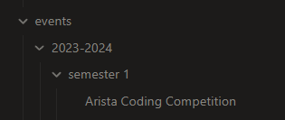

# Style Guide

## File + Directory Names

Directories are in lowercase letters.

Files are named with [Title Case](https://en.wikipedia.org/wiki/Title_case).

## Directory Depth

Directories are not nested more than 3 times.

### Example

`events` -> `2023-2024` -> `semester 1` is 3 directories deep with files inside the last directory, and no more directories inside that. Contact the [Webmaster](committee/webmaster/Webmaster.md) if you want to change this.

## Directory Structure

Every directory created will have a file named according to [File + Directory Names](Style%20Guide.md#File%20+%20Directory%20Names), a "folder file" of sorts. This is used as a directory index file as a minimum, or can be used for a broad overview of topics with links to other related documents as needed. See [Treasurer](committee/treasurer/Treasurer.md) for an example.
